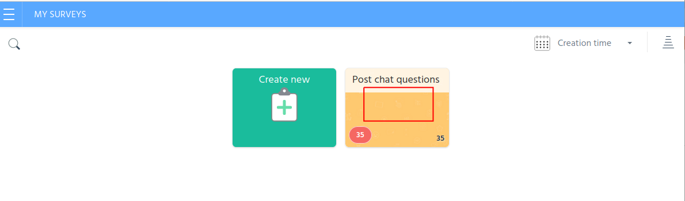

# Improve your customer chat experience with information from your customers by a  post-chat survey
## Integrate surveys with Stream chat
You are providing a chat experience for your customers, but could you improve the experience? What's a great way to know if you could do better?  Ask your customers. Integrating your [Stream Chat](https://getstream.io/chat/docs) with your favorite Survey tool is a relatively painless endeavor. In this post I demonstrate how to launch a survey at the conclusion of a Chat session. I integrate with [SurveyLegend](https://www.surveylegend.com), but many of the major survey tools provide the same integration option that I demonstrate here.

## What the app does

This app presents a simple landing page and on the lower right corner of the page there is a button to iniciate a chat session.


When this button is clicked, the user is presented a form to enter some details and then they join a Chat session.


Once the chat is completed, the user simply closes the chat session by clicking on the large X in the upper right of the screen. *(Note: in a production app, you may want to add some confirmation dialog boxes between closing the chat and launching the survey; we have kept things simple for the purposes of this post.)*


The app then launches the survey as an `iFrame` in the same modal window. Clicking the close `X` in the upper right corner, returns to the initial starting point.


## Technical Overview

The app in this post is composed of a `React` frontend and a `nodjs` backend. The frontend components were bootstrapped using `create-react-app`, and the backend server is an `Express` app running on `nodejs`. Both frontend and backend leverage Stream's [JavaScript library](https://github.com/GetStream/stream-js).

For SurveyLegend, I created a free account and then a simple survey. SurveyLegend automatically provides and iFrame code that I use to launch the survey. This is explained below.

All the code required for this tutorial is available in the github repository [github/stream-chat-survey](LOCATION).

## Prerequisites

To run the app in this post or build it out yourself, you will need a free Stream account (get it [here](https://getstream.io/get_started/?signup=#flat_feed)) and an account with a Survey tool (I use a free SurveyLegend account, sign up [here](https://www.surveylegend.com/register/)).

The code in this post is intended to run locally, and assumes a basic knowledge of [React Hooks](https://reactjs.org/docs/hooks-intro.html), [Express](https://expressjs.com/), and [Node.js](https://nodejs.org/en/ "node website").

## The Process
The steps we will take to configure the `backend` are:

1. [Registering and Configuring Stream](#registering-and-configuring-stream)
2. [Create a Stream Chat Session](#create-a-stream-chat-session)

The steps to build the `frontend app` are:
1. [Bootstrap the Frontend Application](#1---bootstrap-the-frontend-application)
2. []
2. [Authenticate Admin and Customer to the Chat](#2---authenticate-admin-and-custoemr-to-the-chat)
3. [Send messages to Zendesk](#3---send-messages-to-zendesk)
4. [Miscellaneous Backend Endpoints](#4---miscellaneous-backend-endpoints)

### Registering and Configuring Stream

If you choose to build out this app using the code snippets instead of copping the repository from `github`, you can run the following commands in the terminal:

```terminal
cd ~/[your local git folder]

mkdir stream-chat-survey

cd stream-chat-survey

mkdir backend

cd backend

npm init
```

Follow the onscreen instructions inititalize the `backend` app, which will generate a basic structure of the `package.json` file. You can then copy in the following dependencies - or you can simply copy the `package.json` from github.

```jsx
  "devDependencies": {
    "cookie-parser": "^1.4.5",
    "dotenv": "^8.2.0",
    "express": "^4.17.1",
    "morgan": "^1.10.0",
    "stream-chat": "^2.1.0"
  }
```
 and then add this script line as well to your `package.json`:
 ```jsx
  "scripts": {
    "start": "node ./bin/www"
  }
```
Once the changes in the package.json file are made, run the following command to install the npm dependencies in your `backend`.

```terminal
npm install
```
The basic backend functionality is configured in three files, which you can copy from the `backend` folder in github (make sure to also copy the folders):

- bin/www, and
- server.js
- routes/index.js

The last file, `index.js` contains the code that esablishes a `chat session` with Stream. We include this code snippet below for your information

```jsx
const streamChat = require('stream-chat');
const express = require('express');
const router = express.Router();

router.post('/registrations', async (req, res, next) => {
    try {
        const client = new streamChat.StreamChat(
            process.env.STREAM_API_KEY,
            process.env.STREAM_API_SECRET
        );
        const user = {
            id: `${req.body.firstName}-${req.body.lastName}`.toLowerCase(),
            role: 'user',
            image: `https://robohash.org/${req.body.email}`
        };
        await client.upsertUsers([user, { id: 'sales-admin', role: 'admin' }]);
        const channel = client.channel('messaging', user.id, {
            members: [user.id, 'sales-admin'],
        });
        const token = client.createToken(user.id);
        res.status(200).json({
            userId: user.id,
            token,
            channelId: channel.id,
            apiKey: process.env.STREAM_API_KEY
        });
    } catch (error) {
        console.log(error, data.errors);
        res.status(500).json({
            error: error.message
        });
    }
});

module.exports = router;
```
This `registration` router/post defined above, takes the FirstName, LastName, and Email from the frontend app and uses these values to establish a Chat Session. For more information on how this works, check [here](need link).

The final changes needed to configure the `backend`, are to set the two application backend environment variables:

- STREAM_API_KEY
- STREAM_API_SECRET

You will find a file in the Backend folder, `.env.example`, that you can rename to create a `.env` file.

To lookup your `Stream` credentials, navigate to your [Stream.io Dashboard](https://getstream.io/dashboard/)


Then click on "Create App"


Give your app a name and select `Development` and click `Submit`


`Stream` will generate a `Key` and `Secret` for your app. Copy these and update the corresponding environment variables.


When the .env file has been created, run the following commany from your terminal to start the `backend` server.

```terminal
npm start
```
## 1 - Bootstrap the Frontend Application

The `frontend` was bootstrapped using `create-react-app`. For example, inside of your application folder (in this post it is `stream-chat-survey`, from a terminal you would run:

```terminal
npx create-react-app frontend
```
The `frontend` has one depenceny other than `React`, which is the stream chat components. You can intall them with the following command:

```terminal
npm install stream-chat-react
```

When this complete, you will have the basic container to run our frontend code. 

## 2 - Build the application

There are Then you can update the scr/App.js files with the following code. You will note that this sets up a simple landing page.

```jsx
// frontend.../src/App.js:1-19
import React from "react";
import "./App.css";
import ChatWidget from "./chatWidget.js";

function App() {

  return (
      <div className="App">
        <div className="App-header">
          <p>Stream and SurveyLegend Integration</p>
          <div className="image"></div>
          <p>(This is an example landing page)</p>
          <ChatWidget></ChatWidget>
        </div>
      </div>
  );
}

export default App;
```
### Frontend widget for chat and survey

#### Add library references

The chat session and survey functionality is contained within the file, `chatWidget.js`, let's break down what goes on here.

Stream's convenient libraries power the front-end. Here is the list of libraries loaded:

```jsx
// frontend.../src/chatWidget.js:1-11
import React, { useState } from "react";
import { StreamChat } from "stream-chat";
import { Chat, 
    Channel, 
    ChannelHeader, 
    MessageInput, 
    MessageList, 
    Thread, 
    Window, } from 'stream-chat-react';
import 'stream-chat-react/dist/css/index.css';
import "./App.css";
```

The application code is contained a single function, `ChatWidget`. As you can see from the function works with six `React Hooks`

- `chatState`: will be used to manage the flow between the four different interfaces that make up our widget (WAIT, JOIN, CHAT, and SURVEY).
- `email`, `firstName`, `lastName`: are used to store the user input values which are used to initiate the `chat session`.
- `chatClient` and `channel`: used to start a chat session and the corresponding channel.

```jsx
// frontend.../src/chatWidget.js:16-23
function ChatWidget() {
    const [chatState, setChatState] = useState("WAIT"); // WAIT, JOIN, CHAT, SURVEY
    const [email, setEmail] = useState("");
    const [firstName, setFirstName] = useState("");
    const [lastName, setLastName] = useState("");

    const [chatClient, setChatClient] = useState(null);
    const [channel, setChannel] = useState(null);
```
Within the ChatWidget function, there is an asynch call to the backend to establish the chat session. This `register` function first passes the three user input values (email, firstName, lastName - in a production application more information might be required). The function then stores the response from the `backend`, and starts the chat with the `setUser` method.

The function ends with a reset of the Join form input Hooks and lastly `setChatState` changes the `ChatState` to 'WAIT', which will display the chat modal window. More on that below.  

```jsx
// frontend.../src/chatWidget.js:25-57
    async function register(event) {
        event.preventDefault(); // stop processing of form submission
        const response = await fetch("http://localhost:8080/registrations", {
            method: "POST",
            headers: {
                Accept: "application/json",
                "Content-Type": "application/json",
            },
            body: JSON.stringify({
                firstName,
                lastName,
                email,
            }),
        });
        const { userId, token, channelId, apiKey } = await response.json();
        const chatClient = new StreamChat(apiKey);
        await chatClient.setUser(
            {
                id: userId,
                name: email,
                image: `https://getstream.io/random_svg/?id=${userId}`,
            },
            token
        );

        const channel = chatClient.channel("messaging", channelId);
        setChatClient(chatClient);
        setChannel(channel);
        setFirstName(""); //reset FirstName input
        setLastName(""); //reset LastName input
        setEmail(""); //reset Email input
        setChatState("CHAT"); //show the Chat window
    }
```
As mentioned above, the chat widget has four different display or interface states: WAIT, JOIN, CHAT, and SURVEY. The screenshots of these four interfaces were shown at the beginning of the post. Let's take a look at the code for each of these.

```jsx
// frontend.../src/chatWidget.js:59-66
    if (chatState === "WAIT") {
        return (
            <div className="wait">
                <button className="waitbutton" onClick={() => setChatState("JOIN")}>^</button>
                <span className="tooltiptext">Click here to join chat</span>
            </div>
        );
    }

```
The `WAIT` interface isn't much, just a little button that floats on the lower right side of the screen. The user clicks here to initiate a chat, and change the `ChatState` to `JOIN`, the code snippet that follows:

```jsx
// frontend.../src/chatWidget.js:68-113
    if (chatState === "JOIN") {
        return (
            <div className="modal">
                <div className="modal-header" onClick={() => setChatState("WAIT")}>
                    <span className="close" >X
                      <span className="tooltiptext">Return to wait</span>
                    </span>
                </div>
                <div className="modal-content">
                    <form className="card" onSubmit={register}>
                        <label>First Name</label>
                        <p>
                            <input
                                type="text"
                                value={firstName}
                                onChange={(e) => setFirstName(e.target.value)}
                                placeholder="first name"
                                required
                            />
                        </p>
                        <label>Last Name</label>
                        <p>
                            <input
                                type="text"
                                value={lastName}
                                onChange={(e) => setLastName(e.target.value)}
                                placeholder="last name"
                                required
                            />
                        </p>
                        <label>Email</label>
                        <p>
                            <input
                                type="email"
                                value={email}
                                onChange={(e) => setEmail(e.target.value)}
                                placeholder="email"
                                required
                            />
                        </p>
                        <button className="close" type="submit">Start chat</button>
                    </form>
                </div>
            </div>
        );
    }

```

This code creates an `input form` to collect the three fiels that we use to establish the chat session. Closing this form returns the `ChatState` to `WAIT`, and submiting the form call the `register` function and sets the `ChatState` to `CHAT`.

```jsx
// frontend.../src/chatWidget.js:121-146
    if (chatState === "CHAT") {
        return (
            <div id="myModal" class="modal">
                {/* Modal content */}
                <div className="modal-content">
                    <div className="modal-header" onClick={startSurvey}>
                        <span className="close" >X
                          <span className="tooltiptext">Launch Survey</span>
                        </span>
                    </div>
                    <div className="App">
                        <Chat client={chatClient} theme={"messaging light"}>
                            <Channel channel={channel}>
                                <Window>
                                    <ChannelHeader />
                                    <MessageList />
                                    <MessageInput />
                                </Window>
                                <Thread />
                            </Channel>
                        </Chat>
                    </div>
                </div>
            </div>
        );
    }
```

This code displays the `Chat` components that were initialized by the `register` function. Closing this form will kick off a user survey by setting the `ChatState` to `SURVEY`. At this point, it is a good idea to kill the chat session, so I have created a function, `startSurvey`, to do this in addition to setting the `ChatState` - I simply set the `Channel` and `ChatClient` to `null`.

```jsx
// frontend.../src/chatWidget.js:115-119
    function startSurvey() { //this function resets the Chat when initiating Survey
        setChatState("SURVEY");
        setChannel(null); //reset Chat for another user if need be
        setChatClient(null); //reset Chat for another user if need be
    }
```

And now the grand finale, we integrate the Survey! Before we look at the code to call a survey, you have to have a survey to call!

## Get Survey Tool iFrame
I'm not going to describe how to set up a new account with SurveyLegend. I'm confident that you can cover that on your own. You can also create a sample survey, free free to model it on the one I used in the post!

(Note: I have used SurveyLegend in this post, but I know that most Survey tools, such as Survey Monkey, provide an iFrame to embed the survey in a web page.)

I will show you where to grab the `iFrame` code that you will need for the `SURVEY` widget just described. After you have created your survey, when you login to SurveyLegend, it will look something like below.



Once you click on the survey that you created for this exercise, `Post chat questions`, in my example, you will see an option to `Share`.


Once you select Share, you then select the `Embed in web page` option and then copy the `iFrame`. Not too hard, eh?


Once you have an `iFrame` let's integrate it into our application.

I use the same modal component to contain the `iFrame` code that SurveyLegend provided me without any modification - it just works! Cool. Note that closing this widget returns the `ChatState` to `WAIT`. When you paste in your iFrame, you may have to fiddle with the `modal-content` css settings if you don't like the way your survey is framed in the modal window.

One last point about the survey. To avoid that my survey isn't called by hundreds of random software enthusiasts around the internet, I have masked the `URL` for my survey in an `env` variable in the file `...frontend/env.development`. You will find a file called `env.development.example`, that you can rename and paste in the `URL` of your survey. Alternatively, you can also just paste the `URL` into the `src` element of the `iFrame` at line 161.


```jsx
// frontend.../src/chatWidget.js:148-173
    if (chatState === "SURVEY") {
        return (
            /*-- The Modal --*/
            <div id="myModal" className="modal">
                {/* Modal content */}
                <div className="modal-header" onClick={() => setChatState("WAIT")}><span className="close" >X
          <span className="tooltiptext">Return to wait</span>
                </span>
                </div>
                <div className="modal-content">
                    <iframe
                        id="surveylegend-survey"
                        title="my survey"
                        src={process.env.REACT_APP_SURVEY_SRC}
                        width="98%"
                        height="95%"
                        allowtransparency="true"
                        style={{
                            background: "transparent",
                            backgroundColor: "transparent",
                        }}
                    ></iframe>
                </div>
            </div>
        );
    }
```

And that does it! You now understand how to integrate Stream Chat with a your Survey tool. Good luck learning this solution or implementing it into your chat application.
