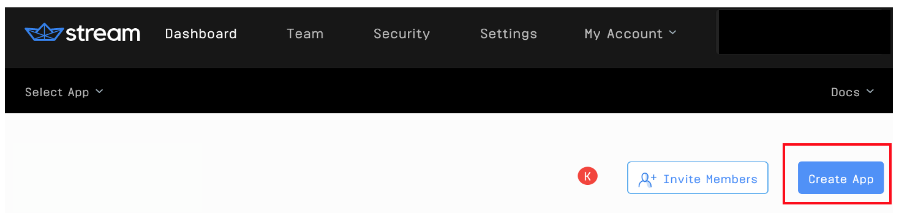

# Improve your customer chat experience with information from your customers by a  post-chat survey
## Integrate surveys with Stream chat
You are providing a chat experience for your customers, but could you improve the experience? What's a great way to know if you could do better?  Ask your customers. Integrating your [Stream Chat](https://getstream.io/chat/docs) with your favorite Survey tool is a relatively painless endeavor. In this post I demonstrate how to launch a survey at the conclusion of a Chat session. I integrate with [SurveyLegend](https://www.surveylegend.com), but many of the major survey tools provide the same integration option that I demonstrate here.

## What the app does

This app presents a simple landing page and on the lower right corner of the page there is a button to iniciate a chat session.


When this button is clicked, the user is presented a form to enter some details and then they join a Chat session.


Once the chat is completed, the user simply closes the chat session by clicking on the large X in the upper right of the screen. *(Note: in a production app, you may want to add some confirmation dialog boxes between closing the chat and launching the survey; we have kept things simple for the purposes of this post.)*


The app then launches the survey as an `iFrame` in the same modal window. Clicking the close `X` in the upper right corner, returns to the initial starting point.


## Technical Overview

The app in this post is composed of a `React` frontend and a `nodjs` backend. The frontend components were bootstrapped using `create-react-app`, and the backend server is an `Express` app running on `nodejs`. Both frontend and backend leverage Stream's [JavaScript library](https://github.com/GetStream/stream-js).

For SurveyLegend, I created a free account and then a simple survey. SurveyLegend automatically provides and iFrame code that I use to launch the survey. This is explained below.

All the code required for this tutorial is available in the github repository [github/stream-chat-survey](LOCATION).

## Prerequisites

To run the app in this post or build it out yourself, you will need a free Stream account (get it [here](https://getstream.io/get_started/?signup=#flat_feed)) and an account with a Survey tool (I use a free SurveyLegend account, sign up [here](https://www.surveylegend.com/register/)).

The code in this post is intended to run locally, and assumes a basic knowledge of [React Hooks](https://reactjs.org/docs/hooks-intro.html), [Express](https://expressjs.com/), and [Node.js](https://nodejs.org/en/ "node website").

## The Process
The steps we will take to configure the `backend` are:

1. [Registering and Configuring Stream](#registering-and-configuring-stream)
2. [Create a Stream Chat Session](#create-a-stream-chat-session)

The steps to build the `frontend app` are:
1. [Bootstrap the Frontend Application](#1---bootstrap-the-frontend-application)
2. []
2. [Authenticate Admin and Customer to the Chat](#2---authenticate-admin-and-custoemr-to-the-chat)
3. [Send messages to Zendesk](#3---send-messages-to-zendesk)
4. [Miscellaneous Backend Endpoints](#4---miscellaneous-backend-endpoints)

### Registering and Configuring Stream

If you choose to build out this app using the code snippets instead of copping the repository from `github`, you can run the following commands in the terminal:

```terminal
cd ~/[your local git folder]

mkdir stream-chat-survey

cd stream-chat-survey

mkdir backend

cd backend

npm init
```

Follow the onscreen instructions inititalize the `backend` app, which will generate a basic structure of the `package.json` file. You can then copy in the following dependencies - or you can simply copy the `package.json` from github.

```jsx
  "devDependencies": {
    "cookie-parser": "^1.4.5",
    "dotenv": "^8.2.0",
    "express": "^4.17.1",
    "morgan": "^1.10.0",
    "stream-chat": "^2.1.0"
  }
```
 and then add this script line as well to your `package.json`:
 ```jsx
  "scripts": {
    "start": "node ./bin/www"
  }
```
Once the changes in the package.json file are made, run the following command to install the npm dependencies in your `backend`.

```terminal
npm install
```
The basic backend functionality is configured in three files, which you can copy from the `backend` folder in github (make sure to also copy the folders):

- bin/www, and
- server.js
- routes/index.js

The last file, `index.js` contains the code that esablishes a `chat session` with Stream. We include this code snippet below for your information

```jsx
const streamChat = require('stream-chat');
const express = require('express');
const router = express.Router();

router.post('/registrations', async (req, res, next) => {
    try {
        const client = new streamChat.StreamChat(
            process.env.STREAM_API_KEY,
            process.env.STREAM_API_SECRET
        );
        const user = {
            id: `${req.body.firstName}-${req.body.lastName}`.toLowerCase(),
            role: 'user',
            image: `https://robohash.org/${req.body.email}`
        };
        await client.upsertUsers([user, { id: 'sales-admin', role: 'admin' }]);
        const channel = client.channel('messaging', user.id, {
            members: [user.id, 'sales-admin'],
        });
        const token = client.createToken(user.id);
        res.status(200).json({
            userId: user.id,
            token,
            channelId: channel.id,
            apiKey: process.env.STREAM_API_KEY
        });
    } catch (error) {
        console.log(error, data.errors);
        res.status(500).json({
            error: error.message
        });
    }
});

module.exports = router;
```
This `registration` router/post defined above, takes the FirstName, LastName, and Email from the frontend app and uses these values to establish a Chat Session. For more information on how this works, check [here](need link).

The final changes needed to configure the `backend`, are to set the two application backend environment variables:

- STREAM_API_KEY
- STREAM_API_SECRET

You will find a file in the Backend folder, `.env.example`, that you can rename to create a `.env` file.

To lookup your `Stream` credentials, navigate to your [Stream.io Dashboard](https://getstream.io/dashboard/)


Then click on "Create App"



Give your app a name and select `Development` and click `Submit`


`Stream` will generate a `Key` and `Secret` for your app. Copy these and update the corresponding environment variables.


When the .env file has been created, run the following commany from your terminal to start the `backend` server.

```terminal
npm start
```
## 1 - Bootstrap the Frontend Application

The `frontend` was bootstrapped using `create-react-app`. For example, inside of your application folder (in this post it is `stream-chat-survey`, from a terminal you would run:

```terminal
npx create-react-app frontend
```

Then you can update the scr/App.js files with the following code. You will note that this sets up a simple landing page.

```jsx
import React from "react";
import "./App.css";
import ChatWidget from "./chatWidget.js";

function App() {

  return (
      <div className="App">
        <div className="App-header">
          <p>Stream and SurveyLegend Integration</p>
          <div className="image"></div>
          <p>(This is an example landing page)</p>
          <ChatWidget></ChatWidget>
        </div>
      </div>
  );
}

export default App;
```

### Add library references

The `app` functionality is contained within the file, `chatWidget.js`, let's break down what goes on here.

Stream's convenient libraries power the front-end. Here is the list of libraries loaded:

```jsx
// frontend.../src/App.js:1-15
import React, { useState, useEffect } from "react";
import {
  Chat,
  Channel,
  Window,
  TypingIndicator,
  MessageList,
  MessageCommerce,
  MessageInput,
  MessageInputFlat,
  withChannelContext
} from "stream-chat-react";
import { StreamChat } from "stream-chat";
import axios from "axios";
import "stream-chat-react/dist/css/index.css";
```

### Frontend function

THIS SECTION TO BE FINISHED ON FRIDAY

And that does it! You now understand how to integrate Stream Chat with Zendesk Sell to update Lead Descriptions (or any other Zendesk component as needed) during your sales chat experience.
