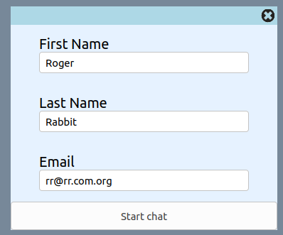
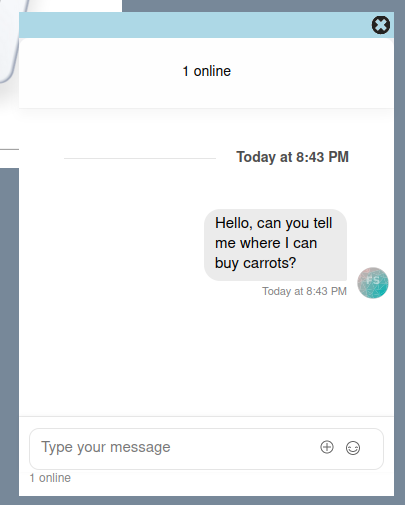
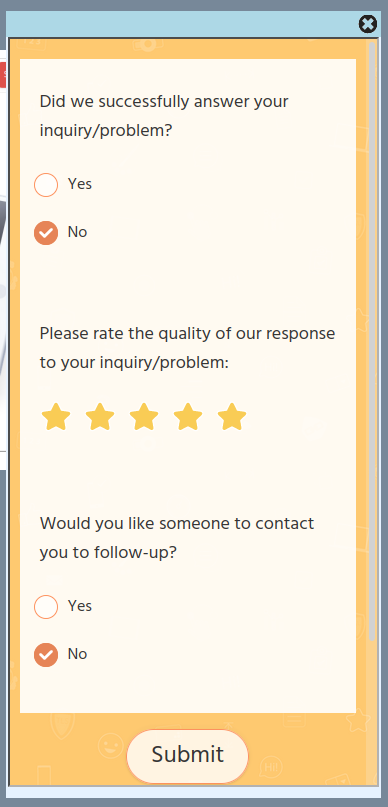

# Improve your customer chat experience with customer feedback

## Integrate surveys with Stream chat

You are providing a chat experience for your customers, but could you improve the experience? What's a great way to know if you could do better? Ask your customers. Integrating your [Stream Chat](https://getstream.io/chat/docs) with your favorite Survey tool is a relatively painless endeavor. This post demonstrates how to launch a survey at the conclusion of a Chat session. We integrate with [SurveyLegend](https://www.surveylegend.com), but many of the major survey tools provide the same integration option that are demonstrated here.

## What the app does

This app presents a simple landing page and on the lower right corner of the page there is a button to initiate a chat session.


 

When this button is clicked, the user is presented with a form to enter some contact details, and then they start the Chat session by submitting the form.

 

Once the chat is completed, the user simply closes the chat session by clicking on the large X in the upper right of the screen, which will then lauch the `survey`. _(Note: in a production app, you may want to add some confirmation dialog boxes between closing the chat and launching the survey; we have kept things simple for the purposes of this post.)_


The app then launches the survey as an `iframe`, and submits it by clicking on `Submit`. After submission of the survey, clicking the close `X` in the upper right corner, returns to the initial starting point.



## Technical Overview

The app in this post is composed of a `React` frontend and a `nodejs` backend. The `frontend` was bootstrapped using `create-react-app`, and the `backend` server was bootstrapped using `express-generator`. Both `frontend` and `backend` leverage Stream's [JavaScript library](https://GitHub.com/GetStream/stream-js).

For SurveyLegend, we created a free account and then a simple survey. SurveyLegend automatically provides and iframe code that is used to launch the survey. This is explained below.

All the code required for this tutorial is available in GitHub [GitHub/stream-chat-survey](https://GitHub.com/keithcrosslin/stream-chat-survey).

## Prerequisites

To run the app in this post or build it out yourself, you will need a free Stream account (get it [here](https://getstream.io/get_started/?signup=#flat_feed)) and an account with a Survey tool (to try a free SurveyLegend account, sign up [here](https://www.surveylegend.com/register/)).

The code in this post is intended to run locally, and assumes a basic knowledge of [React Hooks](https://reactjs.org/docs/hooks-intro.html), [Express](https://expressjs.com/), and [Node.js](https://nodejs.org/en/ "node website").

## The Process Steps

1. [Configure Stream in the backend](#1---configure-stream-in-the-backend)
2. [Build the frontend application](#2---build-the-frontend-application)
3. [Integrate Survey iframe](#3---integrate-survey-iframe)

## 1 - Configure Stream in the backend

For the `backend`, please ensure that you have the following dependencies in your `package.json` file.

```jsx
// backend/package.json:18-24
  "dependencies": {
    "cookie-parser": "^1.4.5",
    "dotenv": "^8.2.0",
    "express": "^4.17.1",
    "morgan": "^1.10.0",
    "stream-chat": "^2.1.0"
  }
```

Once the changes in the package.json file are made, run the following command to install the npm dependencies in your `backend`.

```terminal
npm install
```

The first step to configure the `backend`, is to set the two application environment variables:

- STREAM_API_KEY
- STREAM_API_SECRET

You will find a file in the `backend` folder, `.env.example`, that you can rename to create a `.env` file.

To lookup your `Stream` credentials, navigate to your [Stream.io Dashboard](https://getstream.io/dashboard/)


Then click on "Create App"


Give your app a name and select `Development` and click `Submit`


`Stream` will generate a `Key` and `Secret` for your app. Copy these and update the corresponding environment variables.


Ok, now let's build out the `frontend` app. We will return to the `backend` later to explore the function that communicates with Stream.

One of the files in the `backend` is `routes/index.js`. This is where you will find the code which establishes a `chat session` with Stream. The code snippet for this is shown below for your information

```jsx
// backend/routes/index.js:1-35
const streamChat = require("stream-chat");
const express = require("express");
const router = express.Router();

router.post("/registrations", async (req, res, next) => {
  try {
    const client = new streamChat.StreamChat(
      process.env.STREAM_API_KEY,
      process.env.STREAM_API_SECRET
    );
    const user = {
      id: `${req.body.firstName}-${req.body.lastName}`.toLowerCase(),
      role: "user",
      image: `https://robohash.org/${req.body.email}`,
    };
    await client.upsertUsers([user, { id: "sales-admin", role: "admin" }]);
    const channel = client.channel("messaging", user.id, {
      members: [user.id, "sales-admin"],
    });
    const token = client.createToken(user.id);
    res.status(200).json({
      userId: user.id,
      token,
      channelId: channel.id,
      apiKey: process.env.STREAM_API_KEY,
    });
  } catch (error) {
    console.log(error, data.errors);
    res.status(500).json({
      error: error.message,
    });
  }
});

module.exports = router;
```

This `registration` router/post defined above, takes the `firstName`, `lastName`, and `email` from the frontend app and uses these values to establish a Chat Session. This is explained below.

Ok, so now let's look at how the `frontend` app works.

## 2 - Build the frontend application

Before you build the `frontend`, ensure that the following dependencies are found in your `frontend/package.json` file:

```jsx
// frontend/package.json:5-10
"dependencies": {
    "cors": "^2.8.5",
    "react": "^16.13.1",
    "react-dom": "^16.13.1",
    "react-scripts": "3.4.3",
    "stream-chat-react": "^2.2.2"
}
```

And as with the `backend`, run `npm install` to ensure the dependencies are present in your application.

Update the standard `src/App.js` file with the following code to setup a simple landing page.

```jsx
// frontend/src/App.js:1-21
import React from "react";
import "stream-chat-react/dist/css/index.css";
import "./App.css";
import ChatWidget from "./ChatWidget.js";
import landimage from "./stream_and_surveylegend.png";

function App() {
  return (
    <div className="App">
      <div className="App-header">
        <p>Stream and SurveyLegend Integration</p>
        <div>
          </img>
        </div>
        <p>(This is an example landing page)</p>
        <ChatWidget></ChatWidget>
      </div>
    </div>
  );
}

export default App;
```

### Frontend widget for chat and survey

The chat session and survey functionality is contained within the file, `ChatWidget.js`, let's break down what goes on here.

Stream's convenient libraries power the front-end. Here is the list of libraries loaded (which includes some image references):

```jsx
// frontend/src/ChatWidget.js:1-13
import React, { useState } from "react";
import { StreamChat } from "stream-chat";
import {
  Chat,
  Channel,
  ChannelHeader,
  MessageInput,
  MessageList,
  Thread,
  Window,
} from "stream-chat-react";
import chaticon from "./chat-icon-white.png";
import closeicon from "./close-icon.png";
```

The application code is contained a single function, `ChatWidget`. As you can see from the following code snippet (not the entire function, which is broken down into snippets below) the function works with six React Hooks.

- `chatState`: will be used to manage the flow between the four different interface components that make up our widget (WAIT, JOIN, CHAT, and SURVEY).
- `firstName`, `lastName`, `email`: are used to store the user input values which are used to initiate the `chat session`.
- `chatClient` and `channel`: used to start a chat session and the corresponding channel.

```jsx
// frontend/src/ChatWidget.js:15-192
function ChatWidget() {
  const [chatState, setChatState] = useState("WAIT"); // WAIT, JOIN, CHAT, SURVEY
  const [email, setEmail] = useState("");
  const [firstName, setFirstName] = useState("");
  const [lastName, setLastName] = useState("");

  const [chatClient, setChatClient] = useState(null);
  const [channel, setChannel] = useState(null);

  //...lines 24-173

  if (chatState === "WAIT") {
    return wait();
  }

  if (chatState === "JOIN") {
    return join();
  }

  if (chatState === "CHAT") {
    return chat();
  }

  if (chatState === "SURVEY") {
    return survey();
  }
}

export default ChatWidget;
```

As mentioned above, the chat widget has four different display or interface states: `WAIT`, `JOIN`, `CHAT`, and `SURVEY`. The screenshots of these four interfaces were shown at the beginning of the post. Let's take a look at the functions that generate each of these.

```jsx
// frontend/src/ChatWidget.js:58-65
function wait() {
  return (
    <div className="wait" onClick={() => setChatState("JOIN")}>
      </img>
      <span className="tooltiptext">Click to chat</span>
    </div>
  );
}
```

The `WAIT` interface isn't much, just a little button that floats on the lower right side of the screen. The user clicks here to initiate a chat, and change the `ChatState` to `JOIN`, the function that follows:

```jsx
// frontend/src/ChatWidget.js:67-116
function join() {
  return (
    <div className="popup">
      <div className="popup-header" onClick={() => setChatState("WAIT")}>
        </img>
        <span className="tooltiptext">Click to cancel chat</span>
      </div>
      <form onSubmit={register}>
        <div className="popup-content">
          <div className="popup-input">
            <label htmlFor="firstName">First Name</label>
            <input
              id="firstName"
              type="text"
              value={firstName}
              onChange={(e) => setFirstName(e.target.value)}
              placeholder="first name"
              required
            />
          </div>
          <div className="popup-input">
            <label htmlFor="lastName">Last Name</label>
            <input
              id="lastName"
              type="text"
              value={lastName}
              onChange={(e) => setLastName(e.target.value)}
              placeholder="last name"
              required
            />
          </div>
          <div className="popup-input">
            <label htmlFor="email">Email</label>
            <input
              id="email"
              type="email"
              value={email}
              onChange={(e) => setEmail(e.target.value)}
              placeholder="email"
              required
            />
          </div>
        </div>
        <div className="popup-footer">
          <button className="close" type="submit">
            {" "}
            Start chat{" "}
          </button>
        </div>
      </form>
    </div>
  );
}
```

This code creates an `input form` to collect the three fields that are passed on submission to the `backend` to establish a chat session via the `register` function described below. Closing this form returns the `ChatState` to `WAIT`, and submitting the form calls the `register` function which also sets the `ChatState` to `CHAT`.

The is an async call to the `backend` to establish the chat session happens in the `register` function, which first passes the three user input values (email, firstName, lastName - in a production application more information might be required). The function then stores the response from the `backend`, and starts the chat with the `setUser` method.

The function ends with a reset of the Join form input Hooks and lastly `setChatState` changes the `ChatState` to 'WAIT'.

```jsx
// frontend/src/ChatWidget.js:24-56
async function register(event) {
  event.preventDefault(); // stop processing of form submission
  const response = await fetch("http://localhost:8080/registrations", {
    method: "POST",
    headers: {
      Accept: "application/json",
      "Content-Type": "application/json",
    },
    body: JSON.stringify({
      firstName,
      lastName,
      email,
    }),
  });
  const { userId, token, channelId, apiKey } = await response.json();
  const chatClient = new StreamChat(apiKey);
  await chatClient.setUser(
    {
      id: userId,
      name: email,
      image: `https://getstream.io/random_svg/?id=${userId}`,
    },
    token
  );

  const channel = chatClient.channel("messaging", channelId);
  setChatClient(chatClient);
  setChannel(channel);
  setFirstName(""); //reset FirstName input
  setLastName(""); //reset LastName input
  setEmail(""); //reset Email input
  setChatState("CHAT"); //show the Chat window
}
```

The function for the `ChatState` of `CHAT` follows:

```jsx
// frontend/src/ChatWidget.js:118-146
function chat() {
  function startSurvey() {
    //this function resets the Chat when initiating Survey
    setChatState("SURVEY");
    setChannel(null); //reset Chat for another user if need be
    setChatClient(null); //reset Chat for another user if need be
  }

  return (
    <div id="myChat" className="popup">
      <div className="popup-header">
        </img>
        <span className="tooltiptext">Close chat to launch Survey</span>
      </div>
      <div className="popup-content">
        <Chat client={chatClient} theme={"messaging light"}>
          <Channel channel={channel}>
            <Window>
              <ChannelHeader />
              <MessageList />
              <MessageInput />
            </Window>
            <Thread />
          </Channel>
        </Chat>
      </div>
    </div>
  );
}
```

This code displays the `Chat` components that were initialized by the `register` function. Closing this form will kick off a user survey by setting the `ChatState` to `SURVEY`. At this point, it is a good idea to kill the chat session, so you will notice towards the top of the `chat` function we set the `Channel` and `ChatClient` to `null`.

And now the grand finale, to integrate the Survey! Before you look at the code to call a survey, you have to have a survey to call!

## 3 - Integrate Survey iframe

We don't describe how to set up a new account with SurveyLegend, as we are confident that you can cover that on your own. You can also create a sample survey, but feel free to model it on the one used in this post!

(Note: This post uses SurveyLegend, but most Survey tools, such as SurveyMonkey, provide an iframe to embed the survey in a web page.)

Once you have created a survey, follow the following instructions to grab the `iframe` code that you will need for the `SURVEY` widget just described. After you have created your survey, when you login to SurveyLegend, it will look something like below.


Once you click on the survey that you created for this exercise, `Post chat questions`, in my example, you will see an option to `Share`.


Once you select Share, you then select the `Embed in web page` option and then copy the `iframe`. Not too hard, eh?


Once you have an `iframe` let's integrate it into our application.

We use the `iframe` code that SurveyLegend provided without any modification - it just works, which is cool! By the way, note that closing the Survey widget returns the `ChatState` to `WAIT`.

One last point about the survey. To avoid that my survey isn't called by hundreds of random software enthusiasts around the internet, we have masked the `URL` for my survey in an `env` variable in the file `frontend/.env`. You will find a file called `.env.example`, that you can rename and paste in the `URL` of your survey. Alternatively, you can also just paste the `URL` into the `src` element of the `iframe` at line 160. The `survey` function follows:

```jsx
// frontend/src/ChatWidget.js:148-173
function survey() {
  return (
    <div className="popup">
      <div className="popup-header">
         setChatState("WAIT")}></img>
        <span className="tooltiptext">Click to return to Wait</span>
      </div>
      <div className="popup-content">
        <div className="survey">
          <iframe
            id="surveylegend-survey"
            title="my survey"
            src={process.env.REACT_APP_SURVEY_SRC}
            width="98%"
            height="98%"
            allowtransparency="true"
            style={{
              background: "transparent",
              backgroundColor: "transparent",
            }}
          ></iframe>
        </div>
      </div>
    </div>
  );
}
```

And that does it! You now understand how to integrate Stream Chat with your Survey tool. Good luck learning this solution and then implementing it into your chat application.
